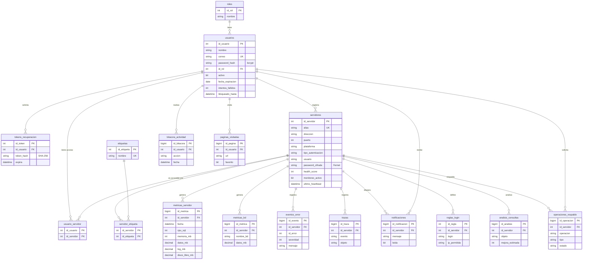
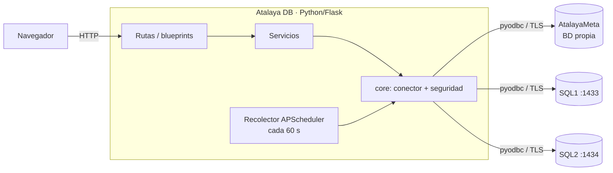

# Diagrama entidad-relación – AtalayaMeta

Se puede ver renderizado en GitHub (soporta Mermaid) o pegarlo en https://mermaid.live para exportarlo como imagen.

```mermaid
erDiagram
    roles ||--o{ usuarios : "tiene"
    usuarios ||--o{ tokens_recuperacion : "solicita"
    usuarios ||--o{ usuario_servidor : "tiene acceso"
    servidores ||--o{ usuario_servidor : "es accesible por"
    usuarios ||--o{ servidores : "registra"
    servidores ||--o{ servidor_etiqueta : ""
    etiquetas ||--o{ servidor_etiqueta : ""
    servidores ||--o{ metricas_servidor : "genera"
    servidores ||--o{ metricas_bd : "genera"
    servidores ||--o{ eventos_error : "registra"
    servidores ||--o{ trazas : "registra"
    servidores ||--o{ notificaciones : "dispara"
    servidores ||--o{ reglas_login : "define"
    servidores ||--o{ analisis_consultas : "analiza"
    servidores ||--o{ operaciones_respaldo : "respalda"
    usuarios ||--o{ operaciones_respaldo : "solicita"
    usuarios ||--o{ bitacora_actividad : "realiza"
    usuarios ||--o{ paginas_visitadas : "visita"
    usuarios ||--o{ notificaciones : "recibe"

    roles { int id_rol PK
            string nombre }
    usuarios { int id_usuario PK
               string nombre
               string correo UK
               string password_hash "bcrypt"
               int id_rol FK
               bit activo
               date fecha_expiracion
               int intentos_fallidos
               datetime bloqueado_hasta }
    tokens_recuperacion { int id_token PK
                          int id_usuario FK
                          string token_hash "SHA-256"
                          datetime expira }
    servidores { int id_servidor PK
                 string alias UK
                 string direccion
                 int puerto
                 string plataforma
                 string tipo_autenticacion
                 string usuario
                 string password_cifrada "Fernet"
                 int health_score
                 bit monitoreo_activo
                 datetime ultimo_heartbeat }
    etiquetas { int id_etiqueta PK
                string nombre UK }
    servidor_etiqueta { int id_servidor PK
                        int id_etiqueta PK }
    usuario_servidor { int id_usuario PK
                       int id_servidor PK }
    metricas_servidor { bigint id_metrica PK
                        int id_servidor FK
                        datetime fecha
                        int cpu_sql
                        int memoria_mb
                        decimal datos_mb
                        decimal log_mb
                        decimal disco_libre_mb }
    metricas_bd { bigint id_metrica PK
                  int id_servidor FK
                  string nombre_bd
                  decimal datos_mb }
    eventos_error { bigint id_evento PK
                    int id_servidor FK
                    int id_error
                    int severidad
                    string mensaje }
    trazas { bigint id_traza PK
             int id_servidor FK
             string evento
             string objeto }
    notificaciones { bigint id_notificacion PK
                     int id_servidor FK
                     string mensaje
                     bit leida }
    bitacora_actividad { bigint id_bitacora PK
                         int id_usuario FK
                         string accion
                         datetime fecha }
    reglas_login { int id_regla PK
                   int id_servidor FK
                   string login
                   string ip_permitida }
    analisis_consultas { bigint id_analisis PK
                         int id_servidor FK
                         string objeto
                         int mejora_estimada }
    operaciones_respaldo { bigint id_operacion PK
                           int id_servidor FK
                           string operacion
                           string tipo
                           string estado }
    paginas_visitadas { bigint id_pagina PK
                        int id_usuario FK
                        string url
                        bit favorito }
```

## Arquitectura

```mermaid
flowchart LR
    N[Navegador] -- HTTP --> R
    subgraph APP[Atalaya DB · Python/Flask]
      R[Rutas / blueprints] --> S[Servicios]
      S --> C[core: conector + seguridad]
      P[Recolector APScheduler<br>cada 60 s] --> C
    end
    C -- pyodbc / TLS --> M[(AtalayaMeta<br>BD propia)]
    C -- pyodbc / TLS --> I1[(SQL1 :1433)]
    C -- pyodbc / TLS --> I2[(SQL2 :1434)]
```
